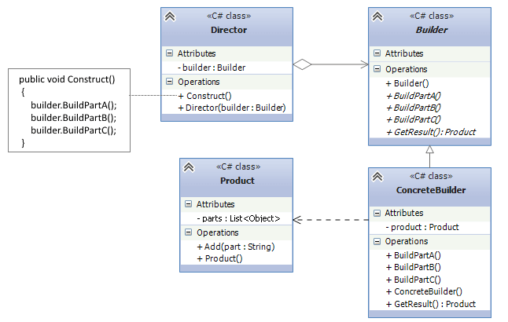

# Паттерны проектирования

Паттерны проектирования - способ построения программного кода.

## Cодержание

1. [Классификация паттернов](#классификация-паттернов)
2. [Пораждающие](#пораждающие)
    - [Фабричный метод](#фабричный-метод)
    - [Абстрактная фабрика](#абстрактная-фабрика)
    - [Строитель](#строитель)


## Классификация паттернов

- __Пораждающие__ - гибкое управление процессом создания объектов.
- __Структурные__
- __Поведенческие__

## Пораждающие

```
Это группа паттернов, которые отвечают за создание объектов, позволяя гибко управлять процессом их создания. Эти паттерны помогают создавать объекты таким образом, чтобы они были легко заменяемы и масштабируемы, а также способствуют снижению зависимости между клиентом и создаваемыми объектами.
```
### Фабричный метод


__Фабричный метод (Factory Method)__ — это порождающий паттерн проектирования, который позволяет создавать объекты, не уточняя конкретный класс объекта, который будет создан. Вместо того чтобы напрямую создавать экземпляр класса, фабричный метод делегирует создание объекта в подклассы, что позволяет изменять тип создаваемого объекта без изменения кода, использующего этот объект.


#### Основная идея

Цель паттерна — предоставить интерфейс для создания объектов, но делегировать этот процесс подклассам. Это позволяет использовать одну и ту же базовую структуру, но иметь возможность создавать различные типы объектов, не изменяя клиентский код.

#### Структура

Creator (Создатель) — это абстрактный класс или интерфейс, который объявляет фабричный метод. Создатель может также реализовать общий функционал для работы с объектами.

ConcreteCreator (Конкретный создатель) — это класс, который реализует фабричный метод и создает конкретный объект.

Product (Продукт) — это абстракция, которая описывает объекты, создаваемые фабричным методом.

ConcreteProduct (Конкретный продукт) — это конкретная реализация продукта, который создается с помощью фабричного метода.


---

#### Задание

Разработка системы для создания различных типов уведомлений

__Условие задачи__: 

Представьте, что вам нужно разработать систему для отправки уведомлений пользователям. Уведомления могут быть разных типов, например, Email, SMS и Push-уведомление.

1. Создайте интерфейс INotification, который будет определять метод Send(), отвечающий за отправку уведомлений.

2. Реализуйте конкретные классы уведомлений:
    - EmailNotification
    - SMSNotification
    - PushNotification

3. Каждый класс должен реализовывать метод Send(), выводящий сообщение в консоль о том, что уведомление отправлено через соответствующий канал.

4. Создайте абстрактный класс NotificationCreator с абстрактным методом CreateNotification(), который будет отвечать за создание уведомлений.

5. Реализуйте конкретные создатели:
    - EmailNotificationCreator
    - SMSNotificationCreator
    - PushNotificationCreator

6. В клиентском коде используйте создателя для создания и отправки уведомлений, не зная, какой конкретный тип уведомления был создан.

__Структура классов__:

- INotification — интерфейс для уведомлений.
- ConcreteNotification (например, EmailNotification) — конкретные типы уведомлений.
- NotificationCreator — абстрактный создатель.
- ConcreteCreator (например, EmailNotificationCreator) — конкретные создатели для каждого типа уведомлений.

__Дополнительные вопросы__:

1. Почему использование фабричного метода помогает избежать жесткой привязки к конкретным типам объектов?
2. Какую роль играет абстракция в паттерне Фабричный метод? Чем она помогает улучшить гибкость системы?

__Пример ожидаемого вывода__:

При создании уведомления через EmailNotificationCreator будет выведено:

```
Отправка Email уведомления...
```

При создании уведомления через SMSNotificationCreator будет выведено:

```
Отправка SMS уведомления...
```
---
### Абстрактная фабрика


__Абстрактная фабрика__ — это порождающий паттерн проектирования, который предоставляет интерфейс для создания семейств взаимосвязанных объектов без указания их конкретных классов.

В отличие от Фабричного метода, который создает один тип объекта, Абстрактная фабрика создает целые семейства объектов, которые могут быть связаны друг с другом. Основная цель — обеспечить гибкость и независимость от конкретных реализаций.

__Структура__

Абстрактная фабрика (AbstractFactory) — определяет интерфейс для создания семейств объектов.

Конкретная фабрика (ConcreteFactory) — реализует интерфейс и создает конкретные объекты.

Абстрактный продукт (AbstractProduct) — определяет интерфейс для группы продуктов.

Конкретный продукт (ConcreteProduct) — конкретная реализация продукта.

Клиент (Client) — использует фабрику для создания продуктов, но не знает о конкретных классах продуктов.

__Пример кода на C#__

1. Интерфейсы продуктов
```csharp
public interface IButton
{
    void Render();
}

public interface ICheckbox
{
    void Render();
}
```
2. Конкретные продукты
```csharp
public class WindowsButton : IButton
{
    public void Render()
    {
        Console.WriteLine("Рендеринг кнопки в стиле Windows");
    }
}

public class MacOSButton : IButton
{
    public void Render()
    {
        Console.WriteLine("Рендеринг кнопки в стиле MacOS");
    }
}

public class WindowsCheckbox : ICheckbox
{
    public void Render()
    {
        Console.WriteLine("Рендеринг чекбокса в стиле Windows");
    }
}

public class MacOSCheckbox : ICheckbox
{
    public void Render()
    {
        Console.WriteLine("Рендеринг чекбокса в стиле MacOS");
    }
}
```

3. Абстрактная фабрика
```csharp
public interface IUIFactory
{
    IButton CreateButton();
    ICheckbox CreateCheckbox();
}
```

4. Конкретные фабрики
```csharp
public class WindowsFactory : IUIFactory
{
    public IButton CreateButton()
    {
        return new WindowsButton();
    }

    public ICheckbox CreateCheckbox()
    {
        return new WindowsCheckbox();
    }
}

public class MacOSFactory : IUIFactory
{
    public IButton CreateButton()
    {
        return new MacOSButton();
    }

    public ICheckbox CreateCheckbox()
    {
        return new MacOSCheckbox();
    }
}
```

5. Клиентский код
```csharp
class Program
{
    static void Main(string[] args)
    {
        Console.WriteLine("Выберите платформу (1 - Windows, 2 - MacOS):");
        string? input = Console.ReadLine();

        IUIFactory factory = input switch
        {
            "1" => new WindowsFactory(),
            "2" => new MacOSFactory(),
            _ => throw new Exception("Неверный ввод")
        };

        // Клиент использует фабрику для создания продуктов
        IButton button = factory.CreateButton();
        ICheckbox checkbox = factory.CreateCheckbox();

        button.Render();
        checkbox.Render();
    }
}
```

__Что происходит в клиентском коде?__

Пользователь выбирает платформу (Windows или MacOS).
В зависимости от выбора, создается WindowsFactory или MacOSFactory.
Используя фабрику, клиент создает кнопку и чекбокс.
Клиентский код не знает, какие конкретные классы создаются. Он просто вызывает методы CreateButton() и CreateCheckbox().

---
__Задание:__

Задача: Создать фабрику для "виртуальной кухни"

- Вы должны создать систему виртуальной кухни, где шеф-повар готовит разные блюда для завтрака и обеда.
- У каждой кухни (например, Итальянская кухня и Японская кухня) есть свои Блюда на завтрак и Блюда на обед.

__Условия__

1. Абстрактные продукты:
    - IBreakfast (Завтрак)
    - ILunch (Обед)

2. Конкретные продукты:
    - Итальянский завтрак: Капучино
    - Итальянский обед: Паста
    - Японский завтрак: Мисо-суп
    - Японский обед: Суши

4. Абстрактная фабрика:
    - ICuisineFactory с методами CreateBreakfast() и CreateLunch()

5. Конкретные фабрики:
    - ItalianCuisineFactory — создает Капучино и Пасту
    - JapaneseCuisineFactory — создает Мисо-суп и Суши

6. Клиент:
    - Спрашивает у пользователя, какую кухню выбрать: Итальянскую или Японскую.
    - Готовит завтрак и обед в зависимости от выбранной кухни.
    - Отображает, что было приготовлено.

__Пример ожидаемого вывода:__

```markdown
Выберите кухню (1 - Итальянская, 2 - Японская):
> 1
Приготовление завтрака: Капучино
Приготовление обеда: Паста
```

__Подсказки:__

- Клиентский код не должен зависеть от конкретных фабрик.
- Используйте switch-case для выбора кухни.

__Бонус-задача:__

- Добавьте третью кухню (Французскую) с её блюдами. Например, Круассан (завтрак) и Рататуй (обед).
---

### Строитель



__Строитель__ — это порождающий паттерн проектирования, который позволяет пошагово создавать сложные объекты. В отличие от фабрики, которая сразу возвращает готовый объект, "Строитель" дает возможность создавать объект по частям и управлять процессом его создания.

__Структура__

- Builder (Строитель) — интерфейс, который определяет шаги для сборки объекта.

- ConcreteBuilder (Конкретный строитель) — конкретная реализация строителя, которая создает части объекта.

- Product (Продукт) — сложный объект, который создается по частям.

- Director (Директор) — объект, который управляет последовательностью шагов построения.

__Когда использовать "Строитель"?__

- Когда объект имеет сложную структуру и состоит из множества частей.
- Когда нужно создавать разные представления одного и того же объекта (например, дом с балконом или без него).
- Когда требуется контроль над процессом создания объекта, а не просто его мгновенное создание через конструктор.

__Пример из реальной жизни__

Представьте, что вы строите дом. В процессе строительства можно:

1. Установить тип фундамента (бетонный, свайный, плитный).
2. Определить, из чего будут сделаны стены (кирпич, дерево, бетон).
3. Указать количество этажей, наличие гаража, бассейна и т. д.

Сначала мы создаём "пустой" дом и поэтапно добавляем ему части. Этот процесс контролирует строитель (Builder), а директор (Director) определяет последовательность шагов.


__Реализация на C#__

```csharp
// 1. Интерфейс строителя
public interface IHouseBuilder
{
    void BuildFoundation();
    void BuildWalls();
    void BuildRoof();
    void BuildGarage();
    House GetResult();
}

// 2. Конкретный строитель
public class WoodenHouseBuilder : IHouseBuilder
{
    private House _house = new House();

    public void BuildFoundation()
    {
        _house.AddPart("Деревянный фундамент");
    }

    public void BuildWalls()
    {
        _house.AddPart("Деревянные стены");
    }

    public void BuildRoof()
    {
        _house.AddPart("Деревянная крыша");
    }

    public void BuildGarage()
    {
        _house.AddPart("Гараж из дерева");
    }

    public House GetResult()
    {
        return _house;
    }
}

// 3. Продукт — дом
public class House
{
    private List<string> _parts = new List<string>();

    public void AddPart(string part)
    {
        _parts.Add(part);
    }

    public void ShowParts()
    {
        Console.WriteLine("Дом построен с использованием следующих частей:");
        foreach (var part in _parts)
        {
            Console.WriteLine("- " + part);
        }
    }
}

// 4. Директор — управляет процессом строительства
public class Director
{
    private IHouseBuilder _builder;

    public Director(IHouseBuilder builder)
    {
        _builder = builder;
    }

    public void ConstructSimpleHouse()
    {
        _builder.BuildFoundation();
        _builder.BuildWalls();
        _builder.BuildRoof();
    }

    public void ConstructLuxuryHouse()
    {
        _builder.BuildFoundation();
        _builder.BuildWalls();
        _builder.BuildRoof();
        _builder.BuildGarage();
    }
}

// 5. Клиентский код
class Program
{
    public static void Main()
    {
        // Создаем конкретного строителя и передаем его директору
        IHouseBuilder builder = new WoodenHouseBuilder();
        Director director = new Director(builder);

        Console.WriteLine("Построим простой дом:");
        director.ConstructSimpleHouse();
        House simpleHouse = builder.GetResult();
        simpleHouse.ShowParts();

        Console.WriteLine("\nПостроим роскошный дом:");
        builder = new WoodenHouseBuilder(); // Сбрасываем состояние строителя
        director = new Director(builder);
        director.ConstructLuxuryHouse();
        House luxuryHouse = builder.GetResult();
        luxuryHouse.ShowParts();
    }
}
```

__Задание:__

Задача: Построить систему для создания бургеров

Создайте приложение для построения различных бургеров. У вас должны быть разные виды булочек, котлет, соусов и добавок.

__Требования:__

1. Интерфейс строителя (IBurgerBuilder):
    - void AddBun(string type) — добавить булочку (белая, цельнозерновая, без глютена).
    - void AddPatty(string type) — добавить котлету (говяжья, куриная, растительная).
    - void AddSauce(string type) — добавить соус (майонез, кетчуп, барбекю).
    - void AddTopping(string topping) — добавить топпинг (сыр, лук, огурцы).
    - Burger GetBurger() — вернуть собранный бургер.
2. Конкретный строитель (CustomBurgerBuilder) — реализует методы сборки.
3. Продукт (Burger) — это бургер, который состоит из списка ингредиентов.
4. Директор (Director) — управляет процессом сборки. У него есть методы MakeClassicBurger() и MakeVeganBurger().

Клиент — пользователь выбирает, какой бургер хочет построить, и программа выводит его состав.

__Уровни сложности__

Легкий: Построить классический бургер с 1 булочкой, 1 котлетой и 1 соусом.

Средний: Добавить опцию для пользователя выбрать дополнительные топпинги.

Сложный: Позволить пользователю самостоятельно выбирать все ингредиенты бургера через консольный ввод.

__Пример работы программы__

```markdown
1. Классический бургер
2. Веганский бургер
3. Собрать бургер вручную

Ваш выбор: 1

Ваш бургер состоит из:
- Булочка: Белая
- Котлета: Говяжья
- Соус: Кетчуп
```
