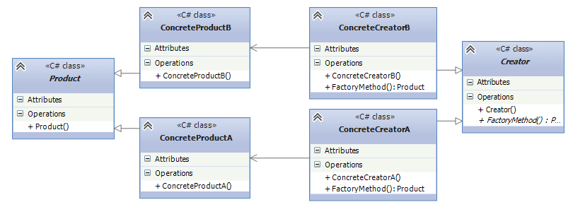

# Паттерны проектирования

Паттерны проектирования - способ построения программного кода.

## Cодержание

1. [Классификация паттернов](#классификация-паттернов)
2. [Пораждающие](#пораждающие)
    - [Фабричный метод](#фабричный-метод)


## Классификация паттернов

- __Пораждающие__ - гибкое управление процессом создания объектов.
- __Структурные__
- __Поведенческие__

## Пораждающие

```
Это группа паттернов, которые отвечают за создание объектов, позволяя гибко управлять процессом их создания. Эти паттерны помогают создавать объекты таким образом, чтобы они были легко заменяемы и масштабируемы, а также способствуют снижению зависимости между клиентом и создаваемыми объектами.
```
### Фабричный метод

__Фабричный метод (Factory Method)__ — это порождающий паттерн проектирования, который позволяет создавать объекты, не уточняя конкретный класс объекта, который будет создан. Вместо того чтобы напрямую создавать экземпляр класса, фабричный метод делегирует создание объекта в подклассы, что позволяет изменять тип создаваемого объекта без изменения кода, использующего этот объект.


#### Основная идея

Цель паттерна — предоставить интерфейс для создания объектов, но делегировать этот процесс подклассам. Это позволяет использовать одну и ту же базовую структуру, но иметь возможность создавать различные типы объектов, не изменяя клиентский код.

#### Структура

Creator (Создатель) — это абстрактный класс или интерфейс, который объявляет фабричный метод. Создатель может также реализовать общий функционал для работы с объектами.

ConcreteCreator (Конкретный создатель) — это класс, который реализует фабричный метод и создает конкретный объект.

Product (Продукт) — это абстракция, которая описывает объекты, создаваемые фабричным методом.

ConcreteProduct (Конкретный продукт) — это конкретная реализация продукта, который создается с помощью фабричного метода.



#### Задание

Разработка системы для создания различных типов уведомлений

__Условие задачи__: 

Представьте, что вам нужно разработать систему для отправки уведомлений пользователям. Уведомления могут быть разных типов, например, Email, SMS и Push-уведомление.

1. Создайте интерфейс INotification, который будет определять метод Send(), отвечающий за отправку уведомлений.

2. Реализуйте конкретные классы уведомлений:
    - EmailNotification
    - SMSNotification
    - PushNotification

3. Каждый класс должен реализовывать метод Send(), выводящий сообщение в консоль о том, что уведомление отправлено через соответствующий канал.

4. Создайте абстрактный класс NotificationCreator с абстрактным методом CreateNotification(), который будет отвечать за создание уведомлений.

5. Реализуйте конкретные создатели:
    - EmailNotificationCreator
    - SMSNotificationCreator
    - PushNotificationCreator

6. В клиентском коде используйте создателя для создания и отправки уведомлений, не зная, какой конкретный тип уведомления был создан.

__Структура классов__:

- INotification — интерфейс для уведомлений.
- ConcreteNotification (например, EmailNotification) — конкретные типы уведомлений.
- NotificationCreator — абстрактный создатель.
- ConcreteCreator (например, EmailNotificationCreator) — конкретные создатели для каждого типа уведомлений.

__Дополнительные вопросы__:

1. Почему использование фабричного метода помогает избежать жесткой привязки к конкретным типам объектов?
2. Какую роль играет абстракция в паттерне Фабричный метод? Чем она помогает улучшить гибкость системы?

__Пример ожидаемого вывода__:

При создании уведомления через EmailNotificationCreator будет выведено:

```
Отправка Email уведомления...
```

При создании уведомления через SMSNotificationCreator будет выведено:

```
Отправка SMS уведомления...
```